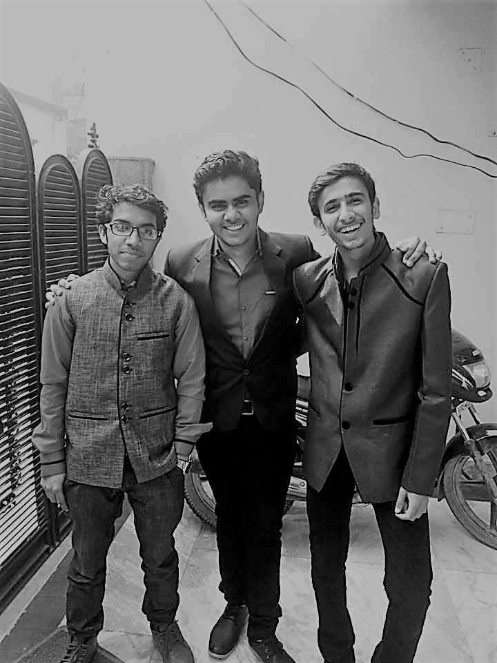
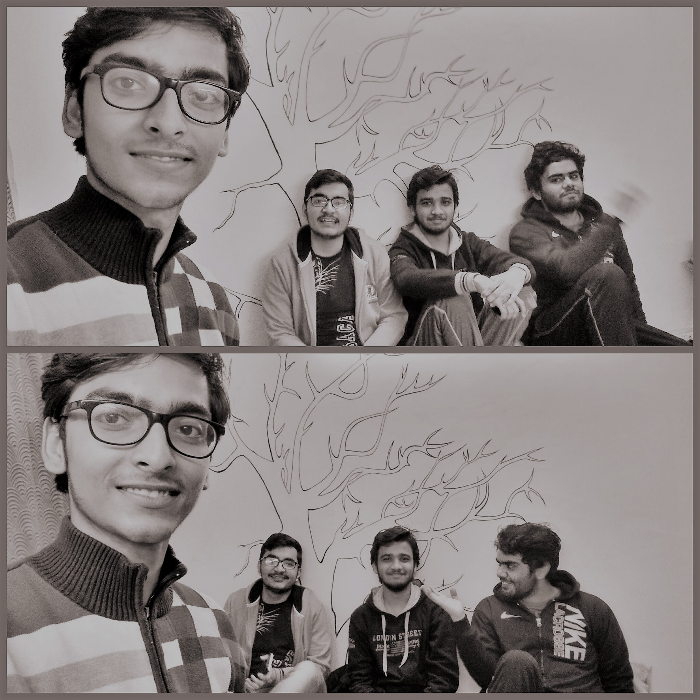
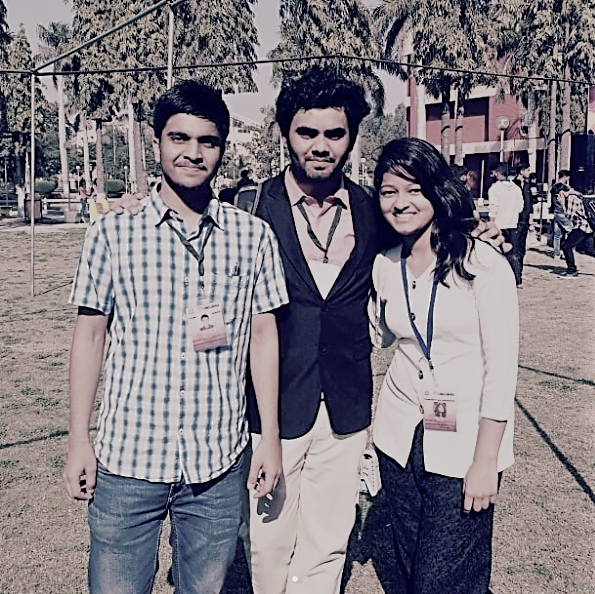

<!DOCTYPE html>
<html>
<title>| Sumit Batra | </title>
<meta charset="UTF-8">
<meta name="viewport" content="width=device-width, initial-scale=1">
<link rel="stylesheet" href="https://www.w3schools.com/w3css/4/w3.css">
<link rel="stylesheet" href="https://fonts.googleapis.com/css?family=Montserrat">
<link rel="stylesheet" href="https://cdnjs.cloudflare.com/ajax/libs/font-awesome/4.7.0/css/font-awesome.min.css">

<body class="w3-black">

<nav class="w3-sidebar w3-bar-block w3-small w3-hide-small w3-center">
  
  <a href="#" class="w3-bar-item w3-button w3-padding-large w3-black">
    <i class="fa fa-home w3-xxlarge"></i>
    
HOME

  </a>
  <a href="#about" class="w3-bar-item w3-button w3-padding-large w3-hover-black">
    <i class="fa fa-user w3-xxlarge"></i>
    
ABOUT

  </a>
  <a href="#photos" class="w3-bar-item w3-button w3-padding-large w3-hover-black">
    <i class="fa fa-eye w3-xxlarge"></i>
    
PHOTOS

  </a>
  <a href="#contact" class="w3-bar-item w3-button w3-padding-large w3-hover-black">
    <i class="fa fa-envelope w3-xxlarge"></i>
    
CONTACT

  </a>
</nav>

  

    <a href="#" class="w3-bar-item w3-button" style="width:25% !important">HOME</a>
    <a href="#about" class="w3-bar-item w3-button" style="width:25% !important">ABOUT</a>
    <a href="#photos" class="w3-bar-item w3-button" style="width:25% !important">PHOTOS</a>
    <a href="#contact" class="w3-bar-item w3-button" style="width:25% !important">CONTACT</a>
  

  <header class="w3-container w3-padding-32 w3-center w3-black" id="home">
    <h1 class="w3-jumbo">I'm Sumit Batra.</h1>
    
 Jack of all trades. Master of some.

    
  </header>

  

    <h2 class="w3-text-light-grey">Sumit Batra</h2>
    

    
 Well for the record, I've been great at motivating people, public relations, etc. I'm also into front-end Web Development, a bit of Table Tennis, Stand-up comedy and what else!  
    

    <h3 class="w3-padding-16 w3-text-light-grey">My Skills</h3>
    
Public Speaking

    

      

    

    
Marketing

    

      

    

    
Web Design

    

      

    

    
Programming

    

      

    

    
Comedy

    

      

    

    
Table Tennis

    

      

    
 
    
    

      

        10+ 
        Student Partner programs
      

      

        5+ 
        Projects Done
      

      

        550+ 
        Facebook friends :P
      

      

        20+ 
        Meetups attended 
      

    

    <button class="w3-button w3-light-grey w3-padding-large w3-section">
      <i class="fa fa-download"></i><a href="cv.pdf"> Download Resume</a>
    </button>
    
    <h3 class="w3-padding-24 w3-text-light-grey">My Reputation</h3>  
    
    
Sidhin S Thomas. CTO at Trymake.

    
"Sumit's always passionate about learning new things. During his internship, the amount of dedication he exhibited was truly phenomenal."" 
 
    
    
    
Utkarsh. CEO at Sophomores.in.

    
"A hardworking guy. Always cheerful and optimistic."

  

  
  

    <h2 class="w3-text-light-grey">My Photos</h2>
    

    

      

        
        
        
      

      

        
        
        
      

    

  

  

    <h2 class="w3-text-light-grey">Contact Me</h2>
    

    

      
<i class="fa fa-map-marker fa-fw w3-text-white w3-xxlarge w3-margin-right"></i> Delhi, India

      
<i class="fa fa-phone fa-fw w3-text-white w3-xxlarge w3-margin-right"></i> Phone: +91 8683838993

      
<i class="fa fa-envelope fa-fw w3-text-white w3-xxlarge w3-margin-right"> </i> Email: batrasumit687@gmail.com

    
 
    
Lets get in touch. Send me a message:

    <form action="/action_page.php" target="_blank">
      
<input class="w3-input w3-padding-16" type="text" placeholder="Name" required name="Name">

      
<input class="w3-input w3-padding-16" type="text" placeholder="Email" required name="Email">

      
<input class="w3-input w3-padding-16" type="text" placeholder="Subject" required name="Subject">

      
<input class="w3-input w3-padding-16" type="text" placeholder="Message" required name="Message">

      

        <button class="w3-button w3-light-grey w3-padding-large" type="submit">
          <i class="fa fa-paper-plane"></i> SEND MESSAGE
        </button>
      

    </form>
  

  
  <footer class="w3-content w3-padding-64 w3-text-grey w3-xlarge">
    <a href="http://www.facebook.com/starkedup" target="blank"><i class="fa fa-facebook-official w3-hover-opacity"></i></a>
    <a href="http://www.instagram.com/starked_up" target="blank"><i class="fa fa-instagram w3-hover-opacity"></i></a>
    <a href="https://www.linkedin.com/in/sumit-batra-382192140/" target="blank"><i class="fa fa-linkedin w3-hover-opacity"></i></a>
    <a href="https://github.com/sumitbatra23" target="blank"><i class="fa fa-github w3-hover-opacity"></i></a>
  </footer>

</body>
</html>
